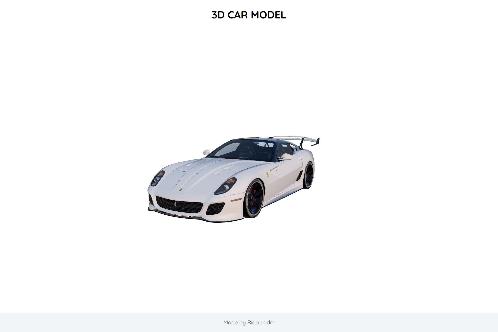

# 3D Car Model Viewer



## About

A sleek, interactive 3D car model viewer built with React, Three.js, and React Three Fiber. This application showcases a Ferrari 599 GTO model in an elegant, well-lit environment with intuitive controls.

## Features

- Interactive 3D car model visualization
- Elegant UI with responsive design for all devices
- Smooth orbital controls for 360° viewing
- Optimized mobile experience
- Beautiful lighting configuration for optimal model presentation

## Technologies

- React
- Three.js
- React Three Fiber
- React Three Drei
- Tailwind CSS

## Getting Started

### Prerequisites

- Node.js (v14.0 or higher)
- npm or yarn

### Installation

1. Clone the repository
   ```bash
   git clone https://github.com/yourusername/3d-car-model-viewer.git
   cd 3d-car-model-viewer
   ```

2. Install dependencies
   ```bash
   npm install
   # or
   yarn install
   ```

3. Start the development server
   ```bash
   npm start
   # or
   yarn start
   ```

4. Open your browser and navigate to `http://localhost:3000`

## Project Structure

```
public/
├── ferrari_599_gto.glb  # 3D model file
├── screenshot.png       # Project screenshot
src/
├── components/
│   └── CarModelViewer.jsx  # Main 3D viewer component
├── App.js
└── index.js
```

## Usage

```jsx
import CarModelViewer from './components/CarModelViewer';

function App() {
  return (
    <div className="App">
      <CarModelViewer />
    </div>
  );
}
```

## Customization

- To change the 3D model, replace the GLB file in the public folder and update the path in the `Model` component
- Adjust lighting parameters in the `Canvas` component for different visual effects
- Modify the styling using Tailwind classes to match your design preferences

## Author

Made by Rida Ladib
